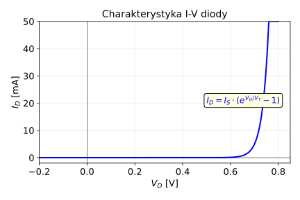
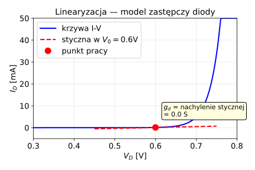
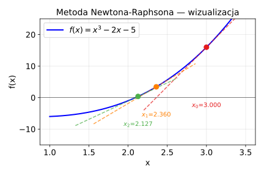
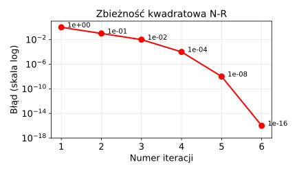
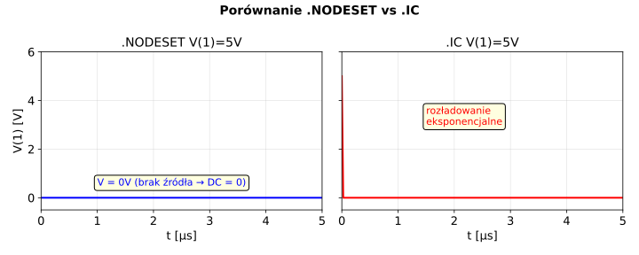

# Laboratoria 1 — Badanie Algorytmów Analizy Stałoprądowej

> **Cel:** Nauczyć się ręcznie konstruować równanie macierzowe obwodu (tak jak robi to SPICE)
> i zrozumieć, jak SPICE radzi sobie z elementami nieliniowymi (diody, tranzystory).

---

## Spis treści

1. [O co w tym chodzi? — intuicja](#1-o-co-w-tym-chodzi--intuicja)
2. [Równanie macierzowe obwodu](#2-równanie-macierzowe-obwodu)
3. [Szablony elementów — krok po kroku](#3-szablony-elementów--krok-po-kroku)
4. [Zmodyfikowana metoda węzłowa (MNA)](#4-zmodyfikowana-metoda-węzłowa-mna)
5. [Przykład 1: Prosty dzielnik napięcia](#5-przykład-1-prosty-dzielnik-napięcia--pełne-rozwiązanie)
6. [Przykład 2: Obwód z dwoma źródłami](#6-przykład-2-obwód-z-dwoma-źródłami)
7. [Przykład 3: Obwód ze źródłem prądowym](#7-przykład-3-obwód-ze-źródłem-prądowym)
8. [Elementy nieliniowe — po co algorytm N-R?](#8-elementy-nieliniowe--po-co-algorytm-n-r)
9. [Algorytm Newtona-Raphsona — krok po kroku](#9-algorytm-newtona-raphsona--krok-po-kroku)
10. [Przykład 4: Obwód z diodą — pełne rozwiązanie N-R](#10-przykład-4-obwód-z-diodą--pełne-rozwiązanie-n-r)
11. [Zbieżność i problemy](#11-zbieżność-i-problemy)
12. [Potencjały startowe (.NODESET vs .IC)](#12-potencjały-startowe-nodeset-vs-ic)
13. [Ściąga na wejściówkę](#13-ściąga-na-wejściówkę)

---

## 1. O co w tym chodzi? — intuicja

Wyobraź sobie, że masz obwód elektryczny z 50 elementami i 20 węzłami. Musisz wyznaczyć napięcia
we wszystkich węzłach. Ręcznie — koszmar. Ale można to zrobić **systematycznie**:

1. Każdy element (rezystor, źródło...) daje pewien **wkład** do wspólnego układu równań
2. Wkłady wszystkich elementów zbieramy w jedną **macierz** i jeden **wektor**
3. Rozwiązujemy układ równań — dostajemy wszystkie napięcia naraz

To jest dokładnie to, co robi SPICE. A Ty musisz umieć to zrobić ręcznie dla małych obwodów.

**Analogia:** Wyobraź sobie arkusz Excela. Każdy element obwodu „wpisuje" swoje wartości
do odpowiednich komórek. Na końcu Excel rozwiązuje układ równań.

---

## 2. Równanie macierzowe obwodu

Cały obwód opisujemy jednym równaniem:

```
    G  ·  V  =  I

    ↑      ↑      ↑
 macierz  wektor  wektor
  n × n   n × 1   n × 1
```

| Symbol | Co to jest | Skąd się bierze |
|--------|-----------|-----------------|
| **G** | Macierz konduktancji | Z rezystorów i innych elementów |
| **V** | Wektor napięć węzłowych | **To szukamy!** |
| **I** | Wektor wymuszeń (prądów) | Ze źródeł prądowych |
| **n** | Liczba węzłów | Liczymy w obwodzie (bez masy) |

### Węzeł odniesienia (masa)

```
         ┌─── węzeł 1
         │
    ┌────┤
    │    │
    R1   R2
    │    │
    └────┘
         │
        ═══  ← węzeł 0 (masa, odniesienie)
```

Jeden węzeł nazywamy **masą** (węzeł 0). Napięcia pozostałych mierzymy **względem niego**.
Masa nie wchodzi do równania macierzowego — dlatego mamy n węzłów, nie n+1.

---

## 3. Szablony elementów — krok po kroku

**Szablon** (ang. stamp) to przepis: „jeśli masz dany element, wpisz takie wartości
w takie miejsca macierzy". Działamy jak stempel — stąd nazwa.

### 3.1 Rezystor — najważniejszy szablon

**Zasada:** Rezystor o konduktancji G = 1/R między węzłami **i** i **j** daje:


```
              kolumna i   kolumna j       wektor I
wiersz i  [    +G          -G     ]       [  0  ]
wiersz j  [    -G          +G     ]       [  0  ]
```

**Dlaczego tak?** Bo prawo Kirchhoffa mówi: suma prądów w węźle = 0.
- Prąd przez rezystor z i do j: I = G·(Vi - Vj) = G·Vi - G·Vj
- W węźle i ten prąd **wypływa**: +G·Vi - G·Vj
- W węźle j ten prąd **wpływa**: -G·Vi + G·Vj

**Przypadek szczególny — rezystor do masy:**


```
              kolumna i       wektor I
wiersz i  [    +G     ]       [  0  ]
```

Tylko jedno miejsce w macierzy (masa nie ma wiersza/kolumny).

---

### 3.2 Źródło prądowe

**Zasada:** Źródło prądowe Is, strzałka od węzła **a** do węzła **b**:


```
              (nic w macierzy G)     wektor I
wiersz a                              [ -Is ]  ← prąd WYPŁYWA z a
wiersz b                              [ +Is ]  ← prąd WPŁYWA do b
```

Źródło prądowe **nie zmienia macierzy G** — wpływa tylko na wektor I.

**Zapamiętaj:** strzałka źródła wskazuje kierunek prądu. Węzeł, z którego prąd wypływa, dostaje **minus**.

---

### 3.3 Źródło napięciowe — problem!


**Problem:** Konduktancja źródła napięciowego = ∞ (opór = 0). Nie da się wpisać ∞ do macierzy!

**Rozwiązanie:** Zmodyfikowana metoda węzłowa (MNA) — patrz następny rozdział.

---

## 4. Zmodyfikowana metoda węzłowa (MNA)

### Idea — w prostych słowach

Gdy mamy źródło napięciowe, robimy dwie rzeczy:
1. **Dodajemy nową niewiadomą** — prąd płynący przez to źródło (I_V)
2. **Dodajemy nowe równanie** — „napięcie między węzłami = Vs"

Macierz się powiększa:

```
    ┌─────────┬───────┐   ┌─────┐   ┌─────┐
    │         │       │   │     │   │     │
    │    G    │   B   │   │  V  │   │  I  │
    │  n × n  │ n × m │ · │     │ = │     │
    ├─────────┼───────┤   ├─────┤   ├─────┤
    │    C    │   D   │   │  J  │   │  E  │
    │  m × n  │ m × m │   │     │   │     │
    └─────────┴───────┘   └─────┘   └─────┘

    n = liczba węzłów
    m = liczba dodatkowych zmiennych (np. prądów przez źródła napięciowe)
```

| Blok | Co zawiera |
|------|-----------|
| **G** | Konduktancje (jak wcześniej) |
| **B, C** | Powiązania między węzłami a nowymi zmiennymi |
| **D** | Zwykle zera |
| **V** | Szukane napięcia węzłowe |
| **J** | Szukane prądy (nowe niewiadome) |
| **I** | Wymuszenia prądowe |
| **E** | Wymuszenia napięciowe |

### Szablon źródła napięciowego w MNA

Źródło Vs, biegun (+) w węźle **i**, biegun (-) w węźle **j**:


Dodajemy niewiadomą **I_V** (prąd przez źródło, płynący od + do -):

```
              kol. i   kol. j   kol. I_V      RHS (prawa strona)
wiersz i  [                      +1     ]     [      ]
wiersz j  [                      -1     ]     [      ]
wiersz I_V[   +1       -1        0      ]     [  Vs  ]
```

**Co oznaczają te wpisy?**

| Wpis | Znaczenie |
|------|-----------|
| +1 w wierszu i, kolumna I_V | Prąd I_V wpływa do węzła i (KCL) |
| -1 w wierszu j, kolumna I_V | Prąd I_V wypływa z węzła j (KCL) |
| +1 w wierszu I_V, kolumna i | Równanie: Vi... |
| -1 w wierszu I_V, kolumna j | ...minus Vj... |
| Vs w RHS wiersza I_V | ...równa się Vs → Vi - Vj = Vs |

---

## 5. Przykład 1: Prosty dzielnik napięcia — pełne rozwiązanie

### Obwód


### Krok 1: Inwentaryzacja

| Element | Typ | Węzły | Wartość |
|---------|-----|-------|---------|
| V1 | Źródło napięciowe | 1(+) — 0(-) | 10 V |
| R1 | Rezystor | 1 — 2 | 1 kΩ → G1 = 1 mS |
| R2 | Rezystor | 2 — 0 | 2 kΩ → G2 = 0.5 mS |

- Węzły: **2** (węzeł 1, węzeł 2) — masa nie liczymy
- Źródła napięciowe: **1** → dodatkowa zmienna: I_V1
- **Wymiar macierzy: 3 × 3**

### Krok 2: Pusta macierz

```
              V1       V2      I_V1       RHS
wiersz 1  [   0        0        0    ]   [  0  ]
wiersz 2  [   0        0        0    ]   [  0  ]
wiersz IV1[   0        0        0    ]   [  0  ]
```

### Krok 3: Stemplujemy R1 (1 mS, węzły 1-2)

```
              V1       V2      I_V1       RHS
wiersz 1  [ +1m      -1m        0    ]   [  0  ]
wiersz 2  [ -1m      +1m        0    ]   [  0  ]
wiersz IV1[   0        0        0    ]   [  0  ]
```

### Krok 4: Stemplujemy R2 (0.5 mS, węzeł 2 — masa)

R2 do masy → dodajemy G2 tylko na przekątnej w wierszu/kolumnie 2:

```
              V1       V2      I_V1       RHS
wiersz 1  [ +1m      -1m        0    ]   [  0  ]
wiersz 2  [ -1m    +1.5m        0    ]   [  0  ]     ← 1m + 0.5m = 1.5m
wiersz IV1[   0        0        0    ]   [  0  ]
```

### Krok 5: Stemplujemy V1 (10V, + na węźle 1, - na masie)

```
              V1       V2      I_V1       RHS
wiersz 1  [ +1m      -1m       +1    ]   [  0  ]
wiersz 2  [ -1m    +1.5m        0    ]   [  0  ]
wiersz IV1[ +1        0         0    ]   [ 10  ]
```

(Biegun - na masie → nie ma wpisu w wierszu masy, bo masa nie jest w równaniu.)

### Krok 6: Rozwiązanie

Z wiersza I_V1: **V1 = 10 V** (oczywiste — to wymusza źródło)

Z wiersza 2: -1m · 10 + 1.5m · V2 = 0

```
V2 = (1m · 10) / 1.5m = 10/1.5 ≈ 6.667 V
```

Z wiersza 1: 1m · 10 - 1m · 6.667 + I_V1 = 0

```
I_V1 = -(10 - 6.667) · 1m = -3.333 mA
```

(Minus oznacza, że prąd płynie w kierunku przeciwnym do przyjętego — źródło **oddaje** prąd.)

### Weryfikacja

Dzielnik napięcia: V2 = V1 · R2/(R1+R2) = 10 · 2000/3000 = 6.667 V ✓

Prąd: I = V1/(R1+R2) = 10/3000 = 3.333 mA ✓

---

## 6. Przykład 2: Obwód z dwoma źródłami

### Obwód


### Inwentaryzacja

- 2 węzły, 2 źródła napięciowe → 2 dodatkowe zmienne (I_V1, I_V2)
- Wymiar: **4 × 4**

### Stemplowanie

V1 = 5V: (+) na węźle 1, (-) na masie
V2 = 3V: (+) na węźle 1, (-) na masie
R = 1kΩ: węzły 1-2, G = 1 mS
R = 2kΩ: węzeł 2 - masa, G = 0.5 mS

```
              V1       V2     I_V1    I_V2       RHS
wiersz 1  [ +1m      -1m      +1      +1   ]   [  0  ]
wiersz 2  [ -1m    +1.5m       0       0   ]   [  0  ]
wiersz IV1[ +1        0        0       0   ]   [  5  ]
wiersz IV2[ +1        0        0       0   ]   [  3  ]
```

**Uwaga:** Wiersz IV1 mówi V1 = 5V, wiersz IV2 mówi V1 = 3V. To jest **sprzeczność** (5 ≠ 3)!

Macierz jest **osobliwa** — układ nie ma rozwiązania. Fizycznie: nie można podłączyć
dwóch źródeł napięciowych o różnych wartościach równolegle.

**Wniosek pedagogiczny:** Metoda macierzowa automatycznie wykrywa obwody fizycznie niemożliwe!

---

## 7. Przykład 3: Obwód ze źródłem prądowym

### Obwód


Is = 2mA wpływa do węzła 1 (strzałka w górę = prąd do węzła 1).

### Inwentaryzacja

- 2 węzły (1, 2), brak źródeł napięciowych → wymiar **2 × 2**
- R1 = 1kΩ → G1 = 1 mS, między 1-2
- R2 = 2kΩ → G2 = 0.5 mS, węzeł 1 - masa
- R3 = 3kΩ → G3 = 0.333 mS, węzeł 2 - masa
- Is = 2 mA wpływa do węzła 1

### Stemplowanie krok po kroku

**Pusta macierz:**
```
              V1       V2        RHS
wiersz 1  [   0        0   ]   [  0   ]
wiersz 2  [   0        0   ]   [  0   ]
```

**+ R1 (1mS, węzły 1-2):**
```
              V1       V2        RHS
wiersz 1  [ +1m      -1m   ]   [  0   ]
wiersz 2  [ -1m      +1m   ]   [  0   ]
```

**+ R2 (0.5mS, węzeł 1 - masa):**
```
              V1       V2        RHS
wiersz 1  [ +1.5m    -1m   ]   [  0   ]
wiersz 2  [ -1m      +1m   ]   [  0   ]
```

**+ R3 (0.333mS, węzeł 2 - masa):**
```
              V1       V2        RHS
wiersz 1  [ +1.5m    -1m    ]   [  0   ]
wiersz 2  [ -1m    +1.333m  ]   [  0   ]
```

**+ Is (2mA, wpływa do węzła 1):**
```
              V1       V2        RHS
wiersz 1  [ +1.5m    -1m    ]   [ +2m  ]
wiersz 2  [ -1m    +1.333m  ]   [  0   ]
```

### Rozwiązanie (metoda Cramera lub eliminacja)

```
Z wiersza 2:   V2 = (1m / 1.333m) · V1 = 0.75 · V1

Podstawiamy do wiersza 1:
1.5m · V1 - 1m · 0.75 · V1 = 2m
1.5m · V1 - 0.75m · V1 = 2m
0.75m · V1 = 2m
V1 = 2m / 0.75m = 2.667 V

V2 = 0.75 · 2.667 = 2.000 V
```

### Weryfikacja (KCL w węźle 1)

```
Is - IR2 - IR1 = 0
2mA - V1/R2 - (V1-V2)/R1 = 0
2mA - 2.667/2000 - (2.667-2.000)/1000 = 0
2mA - 1.333mA - 0.667mA = 0 ✓
```

---

## 8. Elementy nieliniowe — po co algorytm N-R?

### Problem — wyjaśnienie na przykładzie

Dotąd wszystkie elementy miały **liniowe** zależności I-V (prąd proporcjonalny do napięcia).
Ale dioda ma charakterystykę **wykładniczą**:



```
I_D = Is · (e^(V_D / V_T) - 1)

Is ≈ 10⁻¹⁴ A  (prąd nasycenia)
V_T ≈ 26 mV    (napięcie termiczne w temp. pokojowej)
```

**Nie da się** wpisać takiej zależności do macierzy G (macierz wymaga liniowych zależności).

### Rozwiązanie — linearyzacja!

W każdym punkcie krzywej można ją **przybliżyć prostą** (styczną):



Styczna w punkcie (V₀, I₀):

```
I_D ≈ I₀ + g_d · (V_D - V₀)
```

gdzie g_d = dI/dV w punkcie V₀ (nachylenie krzywej):

```
g_d = (Is / V_T) · e^(V₀ / V_T)
```

To przybliżenie liniowe możemy **wpisać do macierzy** — to jest model zastępczy diody.

---

## 9. Algorytm Newtona-Raphsona — krok po kroku

### Analogia

Wyobraź sobie, że szukasz miejsca, gdzie krzywa przecina oś X (pierwiastek równania).
Stoisz w jakimś punkcie, rysujesz styczną i sprawdzasz, gdzie styczna przecina oś.
Idziesz do tego miejsca i powtarzasz. Z każdym krokiem jesteś coraz bliżej rozwiązania.



### Algorytm w SPICE — dla obwodu z elementami nieliniowymi

```
┌─────────────────────────────────────────────────────────┐
│  KROK 0: Zgadnij punkt startowy                        │
│          (np. V = 0 na wszystkich węzłach)              │
└─────────────────────────┬───────────────────────────────┘
                          │
                          ▼
┌─────────────────────────────────────────────────────────┐
│  KROK A: Oblicz modele zastępcze elementów nieliniowych │
│          w aktualnym punkcie pracy:                     │
│          • g_d = nachylenie krzywej I-V w tym punkcie   │
│          • I_eq = prąd źródła zastępczego               │
└─────────────────────────┬───────────────────────────────┘
                          │
                          ▼
┌─────────────────────────────────────────────────────────┐
│  KROK B: Zbuduj równanie macierzowe G·V = I             │
│          (teraz już liniowe — dzięki linearyzacji!)     │
└─────────────────────────┬───────────────────────────────┘
                          │
                          ▼
┌─────────────────────────────────────────────────────────┐
│  KROK C: Rozwiąż układ równań → nowe V                  │
└─────────────────────────┬───────────────────────────────┘
                          │
                          ▼
┌─────────────────────────────────────────────────────────┐
│  KROK D: Czy nowe V jest blisko poprzedniego?           │
│          |V_nowe - V_stare| < tolerancja?               │
│                                                         │
│          TAK → KONIEC (znaleziono rozwiązanie!)         │
│          NIE → wróć do KROKU A z nowym V                │
└─────────────────────────────────────────────────────────┘
```

### Model zastępczy diody — schemat

Dioda między węzłami **a** (anoda) i **k** (katoda) w punkcie pracy (V₀, I₀):

| Prawdziwa dioda | Model zastępczy (w jednej iteracji) |
|:---:|:---:|
|  |  |

```
g_d  = (Is / V_T) · e^(V₀ / V_T)     ← konduktancja dynamiczna
I_eq = I₀ - g_d · V₀                  ← prąd źródła zastępczego

gdzie: I₀ = Is · (e^(V₀ / V_T) - 1)  ← prąd w aktualnym punkcie pracy
```

**Szablon w macierzy** (identyczny jak rezystor + źródło prądowe):

```
              kol. a    kol. k       RHS
wiersz a  [   +g_d     -g_d   ]    [ +I_eq ]
wiersz k  [   -g_d     +g_d   ]    [ -I_eq ]
```

---

## 10. Przykład 4: Obwód z diodą — pełne rozwiązanie N-R

### Obwód


**Parametry diody:** Is = 10⁻¹⁴ A, V_T = 26 mV

**Szukamy:** V1, V2, I_V1

### Iteracja 0: Punkt startowy

Zgadujemy: V₁⁰ = 0 V, V₂⁰ = 0 V

**Model diody w punkcie V_D = V₂ - 0 = 0 V:**

```
I₀  = 10⁻¹⁴ · (e^(0/0.026) - 1) = 10⁻¹⁴ · (1 - 1) = 0 A
g_d = 10⁻¹⁴ / 0.026 · e^(0/0.026) = 3.846 · 10⁻¹³ S  ← prawie zero!
I_eq = 0 - 3.846·10⁻¹³ · 0 = 0
```

**Równanie macierzowe (iteracja 0):**

```
              V1        V2        I_V1        RHS
wiersz 1  [ +1m       -1m        +1     ]   [  0     ]
wiersz 2  [ -1m    +1m+g_d        0     ]   [ +I_eq  ]
wiersz IV1[ +1         0          0     ]   [  5     ]
```

Ponieważ g_d ≈ 0 i I_eq ≈ 0:

```
V1 = 5 V,  V2 ≈ 5 V  (prawie cały prąd „chce" płynąć, ale dioda zamknięta)
```

To jest złe rozwiązanie — dioda ma na sobie 5V, co dałoby absurdalny prąd.
Ale to dopiero **pierwsza iteracja** — algorytm się poprawi.

### Iteracja 1: Nowy punkt pracy V_D = 5 V

```
I₁  = 10⁻¹⁴ · (e^(5/0.026) - 1) ≈ ∞  (astronomicznie duży prąd!)
g_d = 10⁻¹⁴/0.026 · e^(5/0.026) ≈ ∞
```

W praktyce SPICE stosuje **ograniczenia** — nie pozwala na tak duże skoki napięcia.
Typowo ogranicza zmianę V_D do kilku V_T na iterację.

### Jak to wygląda w praktyce (ze zbieżnością)

| Iteracja | V_D (napięcie na diodzie) | I_D (prąd) | g_d |
|----------|--------------------------|------------|-----|
| 0 | 0 V | ~0 | ~0 |
| 1 | ~0.5 V (ograniczone) | ~0.2 mA | ~8 mS |
| 2 | ~0.65 V | ~3 mA | ~115 mS |
| 3 | ~0.693 V | ~4.3 mA | ~165 mS |
| 4 | ~0.6932 V | ~4.307 mA | ~165.6 mS |
| **5** | **~0.6932 V** | **~4.307 mA** | **zbieżność!** |

**Rozwiązanie końcowe:**
```
V1 = 5 V
V2 ≈ 0.693 V  (napięcie na diodzie)
I = (V1 - V2) / R = (5 - 0.693) / 1000 ≈ 4.307 mA

Weryfikacja: I_D = Is · (e^(0.693/0.026) - 1) ≈ 4.307 mA ✓
```

---

## 11. Zbieżność i problemy

### Zbieżność kwadratowa — co to znaczy?



W każdej iteracji **błąd podnosi się do kwadratu** — zbieżność jest bardzo szybka
(zwykle 3-7 iteracji wystarczy). Ale to działa **tylko** gdy jesteśmy blisko rozwiązania!

### Kryteria zbieżności w SPICE

SPICE sprawdza **oba** jednocześnie:

| Kryterium | Warunek | Wartość domyślna |
|-----------|---------|-----------------|
| Napięciowe | \|V_nowe - V_stare\| < VNTOL | 1 μV |
| Prądowe | \|I_nowy - I_stary\| < ABSTOL + RELTOL·\|I\| | ABSTOL=1pA, RELTOL=0.001 |

### Co gdy nie zbiega? — parametr ITL1

**ITL1 = 100** (domyślnie) — maks. liczba iteracji. Po 100 iteracjach bez zbieżności → błąd.

### Techniki wspomagania zbieżności

Gdy standardowy algorytm nie zbiega, SPICE próbuje:

```
Próba 1: Normalny N-R
         │
         └──NIE──→ Próba 2: Source stepping
                             (źródła od 0% do 100% małymi krokami)
                             │
                             └──NIE──→ Próba 3: GMIN stepping
                                                 (małe konduktancje do masy)
                                                 │
                                                 └──NIE──→ BŁĄD!
                                                          "No convergence"
```

| Metoda | Co robi | Kiedy pomaga |
|--------|---------|-------------|
| **Source stepping** | Zwiększa źródła od 0 do wartości docelowej | Obwody z wieloma elementami nieliniowymi |
| **GMIN stepping** | Dodaje małe konduktancje do masy | Obwody z izolowanymi węzłami |
| **.NODESET** | Podpowiada punkt startowy | Przerzutniki, obwody z wieloma stanami |

---

## 12. Potencjały startowe (.NODESET vs .IC)

### .NODESET — „podpowiedź"

```
.NODESET V(1) = 5V
```

SPICE dodaje **tymczasowe** źródło 5V, znajduje punkt pracy, **usuwa źródło** i szuka
prawdziwego punktu pracy. Wynik końcowy **nie musi** być 5V.

### .IC — „wymuszenie"

```
.IC V(1) = 5V
```

Napięcie **będzie** 5V na początku analizy (warunek początkowy dla analizy TRAN).

### Porównanie na przykładzie


Obwód RC **bez źródła**:

| Deklaracja | Co się dzieje | V(1) na początku TRAN |
|-----------|--------------|----------------------|
| `.NODESET V(1)=5V` | Tymczasowe źródło 5V → punkt pracy → źródło usunięte → brak źródła → V=0 | **0 V** (płaski przebieg) |
| `.IC V(1)=5V` | Kondensator naładowany do 5V na początku | **5 V** (rozładowanie eksponencjalne) |



---

## 13. Ściąga na wejściówkę

### Szablony elementów — szybki podgląd

```
┌─────────────────────────────────────────────────────────────────┐
│                    SZABLONY ELEMENTÓW                            │
├─────────────────┬───────────────────────────────────────────────┤
│                 │         Macierz G            │   Wektor I     │
│  REZYSTOR       │    i      j                  │                │
│  (G=1/R)        │ i [+G   -G]                  │   [0]          │
│  węzły i-j      │ j [-G   +G]                  │   [0]          │
├─────────────────┼──────────────────────────────┼────────────────┤
│  REZYSTOR       │    i                         │                │
│  do masy        │ i [+G]                       │   [0]          │
├─────────────────┼──────────────────────────────┼────────────────┤
│  ŹRÓDŁO         │                              │                │
│  PRĄDOWE Is     │  (nic)                       │ a: [-Is]       │
│  a → b          │                              │ b: [+Is]       │
├─────────────────┼──────────────────────────────┼────────────────┤
│  ŹRÓDŁO         │    i    j   I_V              │   RHS          │
│  NAPIĘCIOWE Vs  │ i [          +1]             │   [  ]         │
│  (+)i  (-)j     │ j [          -1]             │   [  ]         │
│  (MNA!)         │ IV[+1  -1    0 ]             │   [Vs]         │
├─────────────────┼──────────────────────────────┼────────────────┤
│  DIODA (N-R)    │    a      k                  │                │
│  model zastępczy│ a [+g_d  -g_d]               │ a: [+I_eq]     │
│  w punkcie V₀   │ k [-g_d  +g_d]               │ k: [-I_eq]     │
│                 │ g_d = Is/V_T · e^(V₀/V_T)   │                │
│                 │ I_eq = I₀ - g_d · V₀         │                │
└─────────────────┴──────────────────────────────┴────────────────┘
```

### Algorytm N-R — w trzech zdaniach

1. Zastąp element nieliniowy modelem liniowym (styczna do krzywej w punkcie pracy)
2. Rozwiąż układ liniowych równań → dostaniesz nowy punkt pracy
3. Powtarzaj aż się ustabilizuje (|V_nowe - V_stare| < tolerancja)

### Kluczowe liczby do zapamiętania

| Parametr | Wartość domyślna | Co to jest |
|----------|-----------------|-----------|
| ITL1 | 100 | Maks. iteracji N-R w analizie DC |
| VNTOL | 1 μV | Tolerancja napięciowa zbieżności |
| ABSTOL | 1 pA | Tolerancja prądowa (bezwzgl.) |
| RELTOL | 0.001 | Tolerancja prądowa (względna) |

### 10 pytań i odpowiedzi

| # | Pytanie | Odpowiedź |
|---|---------|-----------|
| 1 | Zapisz szablon rezystora | +G/-G na przekątnej/poza nią |
| 2 | Dlaczego źródło V wymaga MNA? | Bo ma G = ∞, nie wejdzie do macierzy |
| 3 | Co dodaje MNA dla źródła V? | Nową zmienną (prąd) i nowe równanie (Vi-Vj=Vs) |
| 4 | Co robi N-R w jednej iteracji? | Linearyzuje → rozwiązuje → sprawdza zbieżność |
| 5 | Czym jest g_d? | Nachylenie krzywej I-V w punkcie pracy |
| 6 | Zbieżność kwadratowa = ? | Błąd maleje jak kwadrat (10⁻² → 10⁻⁴ → 10⁻⁸) |
| 7 | Co gdy N-R nie zbiega? | Source stepping → GMIN stepping → błąd |
| 8 | .NODESET vs .IC? | Podpowiedź vs wymuszenie |
| 9 | Co to ITL1? | Maks. iteracji DC (domyślnie 100) |
| 10 | Skonstruuj macierz dla dzielnika R | Patrz Przykład 1 wyżej |
